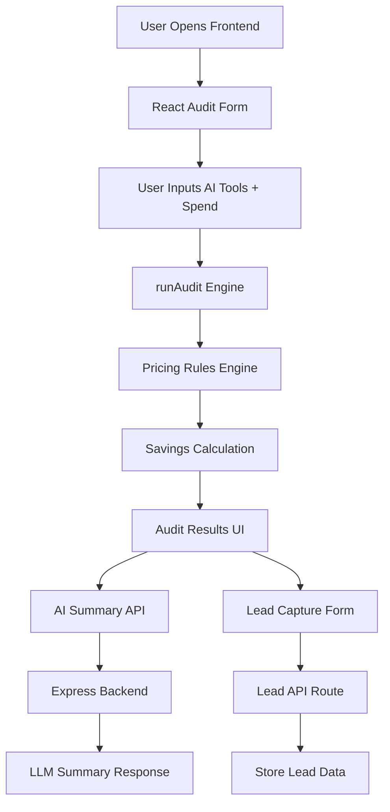

# ARCHITECTURE.md

# AI Spend Audit — System Architecture

## Overview

AI Spend Audit is a lightweight SaaS-style auditing tool that helps startups and teams identify overspending across AI subscriptions such as ChatGPT, Claude, Cursor, Copilot, and Gemini.

The application analyzes:
- tool pricing
- team size
- current spend
- plan mismatches

It then generates:
- savings recommendations
- AI-generated summaries
- lead captures for high-intent users

---

# System Diagram

---

# Frontend Architecture

## Stack
- React
- TypeScript
- Vite
- TailwindCSS

## Why This Stack

### React
Chosen for:
- rapid UI iteration
- strong ecosystem
- reusable component architecture

### TypeScript
Chosen because:
- pricing rules require strong typing
- dynamic tool/plan relationships benefit from inferred types
- prevents invalid pricing access

### Vite
Chosen for:
- fast local development
- lightweight configuration
- excellent TypeScript support

### TailwindCSS
Chosen because:
- rapid UI building
- consistent spacing/styling
- avoids heavy component libraries

---

# Backend Architecture

## Stack
- Node.js
- Express

## Responsibilities
The backend currently handles:
- AI summary endpoint
- lead capture endpoint
- future integrations (email delivery, DB storage)

Endpoints:
- POST /api/summary
- POST /api/save-lead

---

# Audit Engine Flow

## Step 1 — User Input
The user selects:
- AI tool
- pricing plan
- monthly spend
- seat count

---

## Step 2 — Validation
Frontend validates:
- tool exists
- plan selected
- spend > 0

Invalid entries are ignored.

---

## Step 3 — Audit Processing

The `runAudit()` engine:
1. Finds current pricing
2. Compares against cheaper alternatives
3. Calculates savings opportunities
4. Generates recommendations

Example:
- ChatGPT Enterprise → ChatGPT Plus
- Claude Team → Claude Pro

---

## Step 4 — AI Summary

Audit results are sent to the backend.

The backend:
- generates a concise business summary
- returns plain-English optimization advice

Fallback summaries are used if the API fails.

---

# Lead Capture Flow

Users can optionally submit:
- email
- audit results

The backend stores leads for:
- follow-up outreach
- high-savings customer qualification

---

# State Management

Current state is handled using:
- React useState
- localStorage persistence

This was intentionally kept lightweight to reduce complexity.

---

# Data Persistence

Currently:
- audit forms persist in localStorage
- leads are handled server-side

Future production version:
- PostgreSQL
- Supabase
- Redis caching

---

# Security Considerations

## Current Protections
- frontend validation
- backend JSON parsing
- environment variable support

## Future Improvements
- rate limiting
- CAPTCHA
- request throttling
- audit ID signing
- email verification

---

# Scaling To 10k Audits/Day

If the system needed to scale significantly:

## Infrastructure Changes
- deploy backend separately
- add PostgreSQL
- queue AI summary jobs
- add Redis caching layer

## Performance Improvements
- memoize pricing lookups
- move summaries to async workers
- CDN cache static frontend assets

## Reliability
- structured logging
- monitoring
- retry queues
- circuit breakers for AI APIs

---

# Design Tradeoffs

## Why local pricing instead of live APIs?
Pros:
- fast
- deterministic
- easy to test

Cons:
- pricing can become stale

This tradeoff was acceptable for MVP speed.

---

## Why simple state management?
Redux/Zustand were intentionally avoided.

Reason:
- app complexity is still low
- fewer abstractions improves readability

---

## Why server-side AI summary?
This avoids:
- exposing API keys
- browser-side prompt injection risks

---

# Future Improvements

Potential V2 features:
- shareable audit URLs
- PDF exports
- benchmark mode
- referral system
- admin analytics dashboard
- transactional email delivery
- Stripe monetization
- organization accounts

---

# Conclusion

The architecture prioritizes:
- simplicity
- fast iteration
- strong typing
- scalable separation of concerns

The current MVP is intentionally lightweight while still leaving clear upgrade paths for production-scale infrastructure.